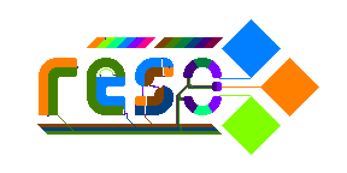

# Reso


[GitHub](https://github.com/lynnpepin/reso) - [GitLab](https://gitlab.com/lynnpepin/reso) - [Blogpost](https://lynndotpy.xyz/posts/reso_intro.html) 

Reso is a low-level circuit design language and simulator, inspired by things like Redstone, Conway's Game of Life, and Wireworld.

(Update: Check out [ashirviskas's Rust implementation](https://github.com/ashirviskas/rust_reso/)! It's way faster than this Python implementation.)

**What is Reso?**

 * Reso is a digital logic circuit graphical programming language!
 * Reso is a digital logic circuit simulator.
 * Reso program outputs other Reso programs.
 * Reso is *not* a cellular automata, despite similarities.
 * Reso is *not* useful or good yet, but I hope you can still have fun with it.

A Reso program is a circuit described by a bitmap image, and the output is another valid Reso program, updating the wire states (on or off). This is described as a pure function, but for performance, it maintains a compiled graph between iterations.

Because images are valid circuits, you can copy-and-paste smaller components to build up more complex circuits using your favorite image editor!

This implementation is (1) slow (it's in Python!) and (2) not-interactive (you can't edit circuits live!) I hope you can have fun with this despite those limitations. :)

**Check out a pure Rust implementation from ashirviskas here: [https://github.com/ashirviskas/rust_reso/](https://github.com/ashirviskas/rust_reso/)**


## Installation

This requires **Python 3**, **Numpy** and **Pillow>=9.0.0**. It's tested on Python 3.6, Numpy 1.21.2, and Pillow 9.0.1. (Don't use Pillow < 9.0.0, it has serious security vulnerabilities.)

**Install from PyPi:**

```
    python -m pip install reso
```


**Install directly from repo:**

```
    python -m pip install git+https://gitlab.com/lynnpepin/reso
```

(This should work. I think.) 

**Build from source as:**

```
    git clone git@gitlab.com:lynnpepin/reso.git --depth 1
    python -m pip install --upgrade pip # upgrade pip
    python -m pip install --upgrade build # install build
    python -m pip install -r requirements.txt

    cd reso
    python -m build

    # Optional: Run tests
    cd tests
    python tests_for_regionmapper.py
    python tests.py
```

**Run tests**

```
```

It is recommended to run `git clone` with flag `--depth 1` since the examples, slides, etc. in this repository makes it heavy.


## Usage

This implementation of Reso supports command line usage. Input is a single image, and outputs are iterations of the Reso simulation of the circuit described in the first image.

### Command line

Here's an example: Load `~/helloworld.png`, *iterate* (`-n`) 12 times, and *save* (`-s`) the results to `~/hello_00.png`, `~/hello_01.png`, ... `~/hello_04.png`, printing information *verbosely* (`-v`) along the way:


```
python -m reso ~/helloworld.png -n 12 -s hello_ -v
```

If you only wanted to save the end result, add the "-o" flag, as such:

```
python -m reso ~/helloworld.png -n 12 -s hello_ -v -o
```

And here is the full command-line usage:

```
usage: reso.py load_location [--numiter NUMITER] [--save SAVE] [--outputlast] [--verbose]    

positional arguments:
  load_location         Location to load image from

other arguments:
  --save SAVE, -s SAVE  Prefix to save images to.
  --numiter ITERATE, -n ITERATE
                        iterate the reso board n times. Defaults to 1.
  --outputlast, -o      Only save the final iteration of the board.
  --verbose, -v         Print extra information; useful for debugging.

```

### Palette

The palette is an important part of Reso! You can define a circuit using an image. Any pixel with a color in this palette of eight colors has semantic meaning, any other color doesn't.


| Color          | Meaning               | Hex code       |
| ---            | ---                   | ---            |
| Bright orange  | Orange wire (on)      | ```#ff8000```  |
| Dark  orange   | Orange wire (off)     | ```#804000```  |
| Bright sapphire| Sapphire wire (on)    | ```#0080ff```  |
| Dark sapphire  | Sapphire wire (off)   | ```#004080```  |
| Bright lime    | Lime wire (on)        | ```#80ff00```  |
| Dark lime      | Lime wire (off)       | ```#408000```  |
| Bright purple  | Output (node to wire) | ```#8000ff```  |
| Dark purple    | Input (wire to node)  | ```#400080```  |
| Bright teal    | XOR logic node        | ```#00ff80```  |
| Dark teal      | AND logic node        | ```#008040```  |

For backwards compatibility with new functionality, we reserve a total of 48 colors. (This is by convention and is not enforced by the Reso simulator.)

*A brief description of how programs run:* **Wires** push their signals through **input nodes**. There are three different colors of wire (orange, sapphire, and lime). Input nodes pass these signals to **logic nodes** and **output nodes**. Logic nodes are used to calculate the 'AND' or 'XOR' of every input signal, and push these on to **output nodes**. The output nodes act as one big *OR* gate, pushing the new signals out to wires.

The colors of different wires don't have any significance. They exist to make it easier to wire in 2D space, and to make it easier to keep track of which wire is which.

Here's the full palette of colors that we consider "reserved". Other colors are 'whitespace', i.e. will not have any semantic significance.

| Hue               | Saturated (1) | Dark (2)      | Light (3)     | Unsaturated (4) |
| ---               | ---           | ---           | ---           | ---           |
| **Red (R)**       | ```#ff0000``` | ```#800000``` | ```#ff8080``` | ```#804040``` |
| **Yellow (Y)**    | ```#ffff00``` | ```#808000``` | ```#ffff80``` | ```#808040``` |
| **Green (G)**     | ```#00ff00``` | ```#008000``` | ```#80ff80``` | ```#408040``` |
| **Cyan (C)**      | ```#00ffff``` | ```#008080``` | ```#80ffff``` | ```#408080``` |
| **Blue (B)**      | ```#0000ff``` | ```#000080``` | ```#8080ff``` | ```#404080``` |
| **Magenta (M)**   | ```#ff00ff``` | ```#800080``` | ```#ff80ff``` | ```#804080``` |
| **Orange (O)**    | ```#ff8000``` | ```#804000``` | ```#ffc080``` | ```#806040``` |
| **Lime (L)**      | ```#80ff00``` | ```#408000``` | ```#c0ff80``` | ```#608040``` |
| **Teal (T)**      | ```#00ff80``` | ```#008040``` | ```#80ffc0``` | ```#408060``` |
| **Sapphire (S)**  | ```#0080ff``` | ```#004080``` | ```#80c0ff``` | ```#406080``` |
| **Purple (P)**    | ```#8000ff``` | ```#400080``` | ```#c080ff``` | ```#604080``` |
| **Violet (V)**    | ```#ff0080``` | ```#800040``` | ```#ff80c0``` | ```#804060``` |

(Note: Don't sample directly from your web-browser! They don't always render colors reliably.)


## Examples

The Reso logo is actually a complete circuit in-and-of itself! Here is a small gif that explains what's going on, animated at 1/4th the speed (that is, one update every 2000ms):


## Roadmap

The Reso Python reference 

 - [ ] **Restructure:** Restructure this and throw it on Pip so people can install it easily.
    - [ ] Oh, and throw it on pip.
    - [ ] Oh also Conda
 - [ ] **Examples:** The more example circuits and components, the better!
 - [ ] **Community:** This blew up! Building a community outside of GitHub issues is hard work. At the minimum, I want to make a Matrix / Discord community for this. 
 - [ ] **Reso spec:** We have an incomplete formal spec (with pretty pictures informal spec) sitting around somewhere. Going to try and get that up soon!
 - [ ] Minor things:
    - [ ] Add a flag to map nearby colors, throwing away a few bits of precision.
    - [ ] Export-to-gif option.
    - [ ] Native format for the compiled graph.
 - [ ] Major things:
    - [ ] Interactive GUI. Perhaps use this [Rust implementation](https://github.com/ashirviskas/rust_reso/) as a WebAssembly backend for a web interface?
    - [ ] Make a GitHub organization for Reso, to combine specs and implementations under one banner.


## See Also

Here are a list of similar projects that I am aware of. Please make an issue or PR if you have something else to share!

 * ashirviskas/IWillPull made a **Rust implementation!** It's blazing fast, check it out: https://github.com/ashirviskas/rust_reso/
 * I've been made aware of several interesting related projects:
    * [Turing Paint](https://byronknoll.com/turing.html) and [Doodle Code](https://byronknoll.com/doodle.html), which have a similar idea of "doodle-able logic circuits".
    * [Wired Logic](https://github.com/martinkirsche/wired-logic), similar to wire-world, simulating circuits in an image.
    * [An in-browser videogame](https://github.com/martinkirsche/wired-logic) that has you build circuits and solve problems.
        - On that note, [Zachtronics](https://www.zachtronics.com/) has many videogames that might scratch a similar itch.
    * 
 * Several sandbox videogames which have turing-complete circuit languages that empower the player to automate their world:
    * Minecraft's *Redstone* was the primary inspiration for this.
    * Terraria (Minecraft's 2D analogue) has a similar logic-gate wiring mechanism.
    * Hempuli is one of my favorite game devs, and seeing their development on [Baba Is You](https://en.wikipedia.org/wiki/Baba_Is_You) kept my brain on the right track for this.
    * Various other open-world sandbox games: Factorio, No Man's Sky, Dwarf Fortress, and others!
 * [Conway's Game of Life](https://en.wikipedia.org/wiki/Conway%27s_Game_of_Life) -- A Turing-complete zero-player-game. By far the most popular cellular automata. Rest in Peace John Conway.
 * [Wireworld](https://en.wikipedia.org/wiki/Wireworld) -- Another cellular automata in which it is easy to implement logic circuits.
 * [Brian's Brain](https://en.wikipedia.org/wiki/Brian%27s_Brain) -- A cellular automaton similar to the previous.
 * [Bitmap Logic Simulator](https://realhet.wordpress.com/2015/09/02/bitmap-logic-simulator/) -- I'm not sure how this works, but check it out! It's a similar idea.
